# Entity-Relationship Diagram

## Robinhood Options Mobile - Data Model

```mermaid
erDiagram
    USER ||--o{ BROKERAGE_USER : "has"
    USER ||--o{ DEVICE : "has"
    USER ||--o{ ORDER_TEMPLATE : "creates"
    USER ||--o{ TRADE_SIGNAL_NOTIFICATION : "receives"
    USER ||--o{ BACKTEST_RESULT : "runs"
    USER }o--o{ INVESTOR_GROUP : "member of"
    USER ||--o| AGENTIC_TRADING_CONFIG : "configures"
    USER ||--o| INVESTMENT_PROFILE : "has"
    USER ||--o| TRADE_SIGNAL_NOTIFICATION_SETTINGS : "has"
    
    BROKERAGE_USER ||--o{ ACCOUNT : "has"
    BROKERAGE_USER ||--o| USER_INFO : "has"
    
    ACCOUNT ||--o| PORTFOLIO : "has"
    ACCOUNT ||--o{ INSTRUMENT_POSITION : "holds"
    ACCOUNT ||--o{ OPTION_POSITION : "holds"
    ACCOUNT ||--o{ FOREX_HOLDING : "holds"
    ACCOUNT ||--o{ INSTRUMENT_ORDER : "places"
    ACCOUNT ||--o{ OPTION_ORDER : "places"
    
    PORTFOLIO ||--o{ PORTFOLIO_HISTORICALS : "tracks"
    
    INSTRUMENT ||--o{ INSTRUMENT_POSITION : "referenced by"
    INSTRUMENT ||--o{ INSTRUMENT_ORDER : "referenced by"
    INSTRUMENT ||--o| OPTION_CHAIN : "has"
    INSTRUMENT ||--o| QUOTE : "has"
    INSTRUMENT ||--o| FUNDAMENTALS : "has"
    INSTRUMENT ||--o{ INSTRUMENT_HISTORICALS : "has"
    INSTRUMENT ||--o{ INSTRUMENT_NOTE : "has"
    INSTRUMENT ||--o{ INSIDER_TRANSACTION : "has"
    INSTRUMENT ||--o{ INSTITUTIONAL_OWNERSHIP : "has"
    INSTRUMENT ||--o| ESG_SCORE : "has"
    INSTRUMENT ||--o| PRICE_TARGET_ANALYSIS : "has"
    INSTRUMENT ||--o| SENTIMENT_DATA : "has"
    
    OPTION_CHAIN ||--o{ OPTION_INSTRUMENT : "contains"
    
    OPTION_INSTRUMENT ||--o{ OPTION_POSITION : "referenced by"
    OPTION_INSTRUMENT ||--o| OPTION_MARKETDATA : "has"
    OPTION_INSTRUMENT ||--o{ OPTION_HISTORICALS : "has"
    
    OPTION_ORDER ||--o{ OPTION_LEG : "contains"
    OPTION_ORDER ||--o{ OPTION_EVENT : "generates"
    
    OPTION_AGGREGATE_POSITION ||--o{ OPTION_POSITION_LEG : "contains"
    OPTION_AGGREGATE_POSITION }o--o| OPTION_INSTRUMENT : "references"
    
    WATCHLIST ||--o{ WATCHLIST_ITEM : "contains"
    
    INVESTOR_GROUP ||--o{ COPY_TRADE_RECORD : "tracks"
    INVESTOR_GROUP ||--o{ COPY_TRADE_SETTINGS : "has"
    
    COPY_TRADE_RECORD }o--|| USER : "source user"
    COPY_TRADE_RECORD }o--|| USER : "target user"
    COPY_TRADE_RECORD }o--|| INVESTOR_GROUP : "belongs to"
    
    AGENTIC_TRADING_CONFIG ||--|| TRADE_STRATEGY_CONFIG : "uses"
    
    BACKTEST_RESULT ||--o{ BACKTEST_TRADE : "contains"
    BACKTEST_RESULT }o--|| TRADE_STRATEGY_CONFIG : "uses"
    
    USER {
        string id PK
        string name
        string email
        string phoneNumber
        string photoUrl
        string role
        datetime dateCreated
        string subscriptionStatus
    }
    
    BROKERAGE_USER {
        string source
        string userName
        string credentials
        bool refreshEnabled
    }
    
    ACCOUNT {
        string accountNumber PK
        string type
        double portfolioCash
        double buyingPower
        string optionLevel
    }
    
    PORTFOLIO {
        string url PK
        double marketValue
        double equity
        double withdrawableAmount
    }
    
    INSTRUMENT {
        string id PK
        string symbol
        string name
        string type
        bool tradeable
        datetime listDate
    }
    
    INSTRUMENT_POSITION {
        string url PK
        double quantity
        double averageBuyPrice
        double marketValue
    }
    
    INSTRUMENT_ORDER {
        string id PK
        string side
        string type
        string state
        double price
        double quantity
        datetime createdAt
    }
    
    OPTION_CHAIN {
        string id PK
        string symbol
        bool canOpenPosition
        array expirationDates
    }
    
    OPTION_INSTRUMENT {
        string id PK
        string chainId FK
        double strikePrice
        datetime expirationDate
        string type
        string state
    }
    
    OPTION_ORDER {
        string id PK
        string chainSymbol
        string direction
        double premium
        string state
        string openingStrategy
        string closingStrategy
    }
    
    OPTION_AGGREGATE_POSITION {
        string strategy
        double marketValue
        double totalCost
        double gainLoss
    }
    
    WATCHLIST {
        string id PK
        string displayName
        string ownerType
        string iconEmoji
    }
    
    INVESTOR_GROUP {
        string id PK
        string name
        string description
        string createdBy FK
        bool isPrivate
        datetime dateCreated
    }
    
    COPY_TRADE_RECORD {
        string id PK
        string sourceUserId FK
        string targetUserId FK
        string groupId FK
        string symbol
        string side
        double quantity
        datetime timestamp
        bool executed
        string status
    }
    
    AGENTIC_TRADING_CONFIG {
        bool autoTradeEnabled
        bool paperTradingMode
        int checkIntervalMinutes
        bool requireApproval
    }
    
    TRADE_STRATEGY_CONFIG {
        string symbolFilter
        string interval
        json indicators
        json entryRules
        json exitRules
    }
    
    BACKTEST_RESULT {
        string id PK
        double finalCapital
        double totalReturn
        double winRate
        double sharpeRatio
        double maxDrawdown
    }
    
    ORDER_TEMPLATE {
        string id PK
        string userId FK
        string name
        string symbol
        string orderType
        string timeInForce
    }
    
    TRADE_SIGNAL_NOTIFICATION {
        string id PK
        string symbol
        string signal
        double confidence
        datetime timestamp
        bool read
    }
```

## How to View This Diagram

1. **GitHub**: Save this file and view it on GitHub - it will render automatically
2. **VS Code**: Install the "Markdown Preview Mermaid Support" extension
3. **Online**: Copy the mermaid code and paste it at https://mermaid.live
4. **Export**: Use mermaid.live to export as PNG, SVG, or PDF

## Entity Descriptions

### Core Trading Entities
- **USER**: Central entity representing app users
- **BROKERAGE_USER**: Connects users to brokerage accounts (Robinhood, Schwab, Plaid)
- **ACCOUNT**: Individual brokerage accounts with buying power and cash
- **PORTFOLIO**: Account portfolio with equity and market values

### Instrument & Position Entities
- **INSTRUMENT**: Stocks, ETFs, and other tradeable securities
- **INSTRUMENT_POSITION**: User's holdings in stocks/ETFs
- **INSTRUMENT_ORDER**: Buy/sell orders for stocks/ETFs

### Options Trading Entities
- **OPTION_CHAIN**: Available options for an underlying instrument
- **OPTION_INSTRUMENT**: Individual option contracts (calls/puts)
- **OPTION_ORDER**: Multi-leg option orders
- **OPTION_AGGREGATE_POSITION**: Grouped option positions (spreads, straddles)

### Social & Automated Trading
- **INVESTOR_GROUP**: Groups for copy trading
- **COPY_TRADE_RECORD**: Tracks copied trades between users
- **AGENTIC_TRADING_CONFIG**: AI-powered automated trading settings
- **TRADE_STRATEGY_CONFIG**: Trading strategy rules and indicators

### Analytics & Tools
- **BACKTEST_RESULT**: Historical strategy simulation results
- **TRADE_SIGNAL_NOTIFICATION**: Buy/sell/hold signals
- **ORDER_TEMPLATE**: Reusable order configurations
- **SENTIMENT_DATA**: Market sentiment analysis
