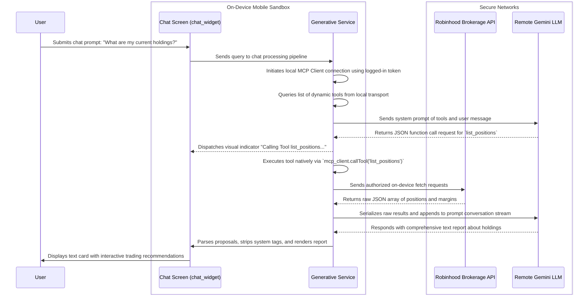

# Robinhood Model Context Protocol (MCP) Integration

RealizeAlpha integrates a highly secure, local **Model Context Protocol (MCP)** execution framework powered by [package:mcp_dart](src/robinhood_options_mobile/pubspec.yaml). This integration enables conversational generative models (specifically Gemini 2.5) to interact natively with your active Robinhood trading accounts on-device without exposing private tokens, brokerage API credentials, or trading secrets to untrusted remote cloud environments.

---

## 1. Architectural Design & Security Flow

The app establishes a local client-driven JSON-RPC channel with the secure sandbox server endpoints. Unlike typical SaaS tools that process client data remotely, this architecture keeps all token exchanges, request composition, and validation steps on-device.

### Data Flow Diagram

---

## 2. Integrated Webview OAuth Authentication Flow

To authorized local trading capabilities, users can prompt an OAuth authentication screen from within their User Settings.

*   **OAuth Entry:** Handled in [src/robinhood_options_mobile/lib/widgets/mcp_oauth_webview.dart](src/robinhood_options_mobile/lib/widgets/mcp_oauth_webview.dart).
*   **Security Protocol:** Uses standard Proof Key for Code Exchange (PKCE) with S256 code challenge sequences (`_generateCodeChallenge` and `_generateCodeVerifier`).
*   **Token Persistence:** Generates unique states on-device, exchanges codes for tokens upon authentication redirects, and saves secure access configurations under localized Storage systems (`getMcpAccessToken`).

---

## 3. Robinhood MCP Tools Reference

The Model Context Protocol server exposes high-fidelity tools dynamically mapped for LLM execution, providing perfect parity with top-tier quantitative and brokerage platforms.

### Account & Portfolio Tools

#### `get_accounts`
Lists the user's connected brokerage accounts detailing account numbers, profile type (e.g. margin, cash, options), and agentic suitability status.
*   **Parameters:** None.
*   **Output:** Returns an array of account profiles containing account numbers, type classification, and status flags.

#### `get_portfolio`
Retrieves a detailed real-time market value breakdown by asset class, cash balance, margin requirements, custody hold boundaries, and buying power.
*   **Parameters:**
    *   `account_number` (*string*, required): Valid account identifier.
*   **Output:** Cash balances, buying power limit thresholds, equity totals, portfolio values, and maintenance margins.

---

### Watchlist Management Tools

#### `get_watchlists`
Lists the user's custom and followed watchlists.
*   **Parameters:** None.
*   **Output:** Array of watchlists containing names, descriptions, emojis, and unique list identifiers (UUIDs).

#### `get_watchlist_items`
Lists all tracked securities configured inside a designated user watchlist.
*   **Parameters:**
    *   `list_id` (*string*, required): The unique watchlist identifier (UUID).
*   **Output:** Array of target instrument tickers, cryptocurrency coins, index symbols, and original registry timestamps.

#### `create_watchlist`
Creates a brand new custom watchlist for the user.
*   **Parameters:**
    *   `display_name` (*string*, required): The name of the new watchlist. Must be unique.
    *   `display_description` (*string*, optional): A short description of the watchlist.
    *   `icon_emoji` (*string*, optional): A single-character emoji to display with the watchlist.
*   **Output:** Watchlist metadata including the newly assigned list UUID, name, and descriptors.

#### `update_watchlist`
Modifies the display details of a custom watchlist.
*   **Parameters:**
    *   `list_id` (*string*, required): The UUID of the target watchlist.
    *   `display_name` (*string*, optional): New name for the watchlist.
    *   `display_description` (*string*, optional): New description.
    *   `icon_emoji` (*string*, optional): New single-character emoji.
*   **Output:** Watchlist metadata reflecting the updated properties.

#### `add_to_watchlist`
Appends assets directly into a target watchlist. Exactly one of symbols, currency_pair_ids, or index_ids is required.
*   **Parameters:**
    *   `list_id` (*string*, required): Watchlist identifier (UUID).
    *   `symbols` (*array of strings*, optional): Stock/ETF tickers (e.g., `["AAPL", "NVDA"]`).
    *   `currency_pair_ids` (*array of strings*, optional): Crypto pair UUIDs.
    *   `index_ids` (*array of strings*, optional): Market index UUIDs (e.g. SPX or NDX).
*   **Output:** Confirmation results indicating successful item additions.

#### `remove_from_watchlist`
Removes assets from a designated watchlist. Exactly one of symbols, currency_pair_ids, or index_ids is required.
*   **Parameters:**
    *   `list_id` (*string*, required): Watchlist identifier (UUID).
    *   `symbols` (*array of strings*, optional): Stock/ETF tickers to remove.
    *   `currency_pair_ids` (*array of strings*, optional): Crypto pair UUIDs to remove.
    *   `index_ids` (*array of strings*, optional): Market index UUIDs to remove.
*   **Output:** Status indicating success or items removed.

#### `follow_watchlist`
Displays a curated pre-existing Robinhood list under the user's watchlists.
*   **Parameters:**
    *   `list_id` (*string*, required): Curiosity list identifier to subscribe to.
*   **Output:** Subscription confirmation properties.

#### `unfollow_watchlist`
Stops displaying a followed curated list under details lists.
*   **Parameters:**
    *   `list_id` (*string*, required): Curved list identifier.
*   **Output:** Unfollow confirmation statuses.

#### `get_popular_watchlists`
Discovers popular curated market sectors or collections to browse or follow.
*   **Parameters:** None.
*   **Output:** Array of curated list UUIDs, names, descriptions, and member counts.

#### `get_option_watchlist`
Queries single-leg options contracts stored on the user's options watchlist.
*   **Parameters:** None.
*   **Output:** Array of option contracts detailing options instruments, strikes, directions, and expiration schedules.

#### `add_option_to_watchlist`
Adds single-leg options contracts to the options watchlist.
*   **Parameters:**
    *   `option_ids` (*array of strings*, required): Contract UUIDs to append (sourced from option instruments).
    *   `position_type` (*string*, optional): Direction categorization (`long` or `short`).
*   **Output:** List status reflecting items added.

---

### Options Market & Orders Tools

#### `get_option_instruments`
Retrieves options contracts matching specific underlying tickers, expiration schedules, strikes, and call/put directions.
*   **Parameters:**
    *   `chain_symbol` (*string*, optional): Underlying ticker (e.g., `AAPL`).
    *   `chain_id` (*string*, optional): Underlying chain UUID.
    *   `expiration_dates` (*string*, optional): Comma-separated YYYY-MM-DD expirations.
    *   `strike_price` (*string*, optional): Exact strike (e.g., `150.0000`).
    *   `type` (*string*, optional): Contract type (`call` or `put`).
    *   `state` (*string*, optional): State (defaults to `active`).
*   **Output:** Array of options instrument contract profiles detailing options IDs, strikes, call/put types, and expiration metrics.

#### `get_option_quotes`
Fetch real-time option market quotes and prices for a set of options contract instrument UUIDs.
*   **Parameters:**
    *   `instrument_ids` (*array of strings*, required): Option instrument UUIDs.
*   **Output:** Bid, ask, bid size, ask size, adjusted mark price, implied volatility, delta, theta, gamma, vega, and prior-session close.

#### `get_option_positions`
Fetches a list of active options legs, multi-leg spreads, or single contracts.
*   **Parameters:**
    *   `account_number` (*string*, required): Valid account identifier.
    *   `nonzero` (*boolean*, optional): Pass `true` to return currently-open positions only (defaults to false).
*   **Output:** Strikes, expiration dates, contract quantities, average cost basis, current mark evaluation, and greeks exposure limits.

#### `get_option_orders`
Fetches a history list of options trades, filled positions, or cancelled order entries for a portfolio.
*   **Parameters:**
    *   `account_number` (*string*, required): Valid account identifier.
    *   `order_id` (*string*, optional): Filter results to one single order UUID.
    *   `state` (*string*, optional): Filter by single state (e.g., `queued`, `filled`, `cancelled`, `rejected`).
*   **Output:** Array of order executions detailing chronological stamps, quantities, premiums, and leg structures.

#### `review_option_order`
Simulates an options contract transaction to retrieve fees, collateral metrics, and pre-trade rules check.
*   **Parameters:**
    *   `account_number` (*string*, required): Target portfolio account (must be agentic_allowed=true AND option_level_2 or option_level_3).
    *   `legs` (*array of objects*, required): Option contract leg specifying `option_id`, `side`, `position_effect`, and `ratio_quantity`.
    *   `quantity` (*string*, required): Contract volume count.
    *   `price` (*string*, optional): Net premium limit per contract.
    *   `type` (*string*, optional): `limit`, `market`, `stop_limit`, or `stop_market`.
    *   `time_in_force` (*string*, optional): `gfd` or `gtc`.
    *   `market_hours` (*string*, optional): `regular_hours`, `regular_curb_hours`, or `regular_curb_overnight_hours` (non-limit immediate forces `regular_hours`).
    *   `chain_symbol` (*string*, optional): Option underlying ticker.
    *   `underlying_type` (*string*, optional): Ticker type (`equity` or `index`).
*   **Output:** Execution quotes, transaction fees, required option collateral liabilities, margin bounds, and critical pre-trade warning messages.

#### `place_option_order`
Executes single-leg or complex multi-leg options strategies.
*   **Parameters:**
    *   `account_number` (*string*, required): Target portfolio account.
    *   `legs` (*array of objects*, required): Array of option contract legs describing type (call/put), expiration, strike, action, and volume.
    *   `quantity` (*string*, required): Number of contracts.
    *   `price` (*string*, required): Net debit or credit limit price.
*   **Output:** Order execution tracking token and fill details.

#### `cancel_option_order`
Submits a secure cancel request for an active, pending options transaction.
*   **Parameters:**
    *   `account_number` (*string*, required): Brokerage account owning the order.
    *   `order_id` (*string*, required): Target order UUID to terminate.
*   **Output:** Success confirmation indicator.

---

### Equity Market & Orders Tools

#### `get_equity_positions`
Fetches a list of active equity, ETF, and mutual fund holdings.
*   **Parameters:**
    *   `account_number` (*string*, required): Valid account identifier.
*   **Output:** Returns holding lists detailing average purchase price, purchase timestamp, shares quantity, and daily gains metrics.

#### `get_equity_quotes`
Fetch real-time quoted figures for underlying equity instruments.
*   **Parameters:**
    *   `symbols` (*array of strings*, required): List of equity tickers (e.g. `["AAPL", "NVDA"]`).
*   **Output:** Real-time bid, ask, bid size, ask size, last trade price, high, low, and prior session close.

#### `get_equity_historicals`
Retrieves historical price data candles for equities.
*   **Parameters:**
    *   `symbols` (*array of strings*, required): Tickers to query.
    *   `start_time` (*string*, required): Start limit (RFC3339 UTC).
    *   `end_time` (*string*, optional): End time defaults to now.
    *   `interval` (*string*, optional): Candle bar size (e.g., `minute`, `5minute`, `30minute`, `day`, `week`).
    *   `bounds` (*string*, optional): Trading session bounds (e.g., `regular`, `extended`, `24_5`).
*   **Output:** Array of OHLCV bar values.

#### `get_equity_orders`
Fetches historical stock orders, trades, and pending items.
*   **Parameters:**
    *   `account_number` (*string*, required): Valid account identifier.
    *   `symbol` (*string*, optional): Filter stock orders to one single ticker symbol.
    *   `state` (*string*, optional): Order state filter (e.g., `filled`, `cancelled`, `rejected`).
*   **Output:** Stock orders array detailing executions, pricing, and timing.

#### `get_equity_fundamentals`
Retrieves comprehensive daily fundamental metrics and ratios for one or more stock symbols.
*   **Parameters:**
    *   `symbols` (*array of strings*, required): Target stock tickers (maximum 10).
    *   `bounds` (*string*, optional): Session bounds (e.g., `regular`, `extended`, `trading`, `24_5`).
*   **Output:** Valuation ratios (P/E, P/B), capitalization metrics (market cap, shares outstanding, float), low/high bounds, dividend schedule, and company descriptions.

#### `get_equity_tradability`
Checks detailed eligibility and fractional trading status constraints for a set of stock symbols under a specified account.
*   **Parameters:**
    *   `account_number` (*string*, required): Valid account identifier.
    *   `symbols` (*array of strings*, required): Stock tickers to check (maximum 10).
*   **Output:** Boolean flags for session eligibility (pre-market, post-market, overnight, fractionals) and tradability blocks.

#### `review_equity_order`
Simulates a stock, ETF, or trust order without executing it, returning pre-trade warnings, cash costs, and margin impact.
*   **Parameters:**
    *   `account_number` (*string*, required): Target portfolio account (must be agentic_allowed=true).
    *   `symbol` (*string*, required): Stock ticker.
    *   `side` (*string*, required): Direction (`buy` or `sell`).
    *   `type` (*string*, required): `market` or `limit` or `stop_market` or `stop_limit`.
    *   `quantity` (*string*, optional): Shares count.
    *   `dollar_amount` (*string*, optional): USD notional limit (market orders only).
    *   `limit_price` (*string*, optional): Limit execution constraint.
    *   `stop_price` (*string*, optional): Stop trigger barrier.
    *   `time_in_force` (*string*, optional): `gfd` or `gtc` (defaults to `gfd`).
    *   `market_hours` (*string*, optional): Session boundaries (e.g., `regular_hours`, `extended_hours`, `all_day_hours`).
*   **Output:** Quote details, estimated transaction charges, margin requirements, custody hold boundaries, and rule warnings (e.g. buying power, pattern day trading).

#### `place_equity_order`
Constructs and logs trade transactions directly with the broker.
*   **Parameters:**
    *   `account_number` (*string*, required): Target portfolio account.
    *   `symbol` (*string*, required): Trade instrument ticker.
    *   `side` (*string*, required): Direction (`buy` or `sell`).
    *   `type` (*string*, required): `market`, `limit`, `stop_market`, or `stop_limit`.
    *   `quantity` (*string*, optional): Shares count to purchase/sell.
    *   `dollar_amount` (*string*, optional): USD notional limit (market orders only).
    *   `limit_price` (*string*, optional): Limit price limit.
    *   `ref_id` (*string*, optional): Idempotency key (UUID) to secure communication across retries.
*   **Output:** Filled status, pending IDs, execution pricing, queue records.

---

### Market Indices & Calendars

#### `get_index_quotes`
Fetch real-time values, stamps, and state changes for major indices.
*   **Parameters:**
    *   `instrument_ids` (*array of strings*, required): Major market index UUIDs (sourced from get_indexes).
*   **Output:** Level evaluations of SPY, QQQ, DIA, or IWM.

#### `get_earnings_calendar`
Discovers macro earnings schedules across the entire market over a given date range.
*   **Parameters:**
    *   `start_date` (*string*, optional): Window anchor formatted as `YYYY-MM-DD` (defaults to today).
    *   `days` (*number*, optional): Date range size in days (max 31). Positive for forward-looking calendar, negative for historical look-back.
    *   `filter` (*string*, optional): Set to `high_market_cap` to limit results to high-liquidity large-caps.
*   **Output:** Upcoming corporate earnings events detailing expected timings, company verification flags, and estimated EPS figures.

#### `get_earnings_results`
Retrieves detailed corporate earnings history, EPS surprise statistics, and report timings for a single ticker.
*   **Parameters:**
    *   `symbol` (*string*, required): Stock ticker.
*   **Output:** Trailing quarterly history of actual and estimated earnings per share (EPS), report timing (AM/PM), and surprise variances.

---

### Scans & Market Screening Tools

#### `create_scan`
Creates a brand new saved scanner configuration on the user's account, allowing custom dynamic filters to parse the market.
*   **Parameters:**
    *   `preset` (*string*, optional): Starting preset template (e.g., `INITIAL`, `DAILY_GAINERS`, `DAILY_LOSERS`, `HIGH_OPTIONS_VOLUME_IV`, `UPCOMING_EARNINGS`).
    *   `filters` (*array of objects*, optional): Custom metric filters specifying filter types, mathematical predicates, intervals, track lengths, and lookups (e.g., RSI metrics, volume bounds).
    *   `title` (*string*, optional): Custom descriptive header name.
*   **Output:** Newly registered scan identifier, filters, column count, and initial real-time market search hits.

#### `get_scans`
Lists all saved market scanners and screeners registered.
*   **Parameters:** None.
*   **Output:** Saved scanners (titles, IDs, active filter definitions, lists of columns, sort orders, and AI/Cortex-management status).

#### `run_scan`
Executes an existing pre-registered market screener evaluation against live realtime quote aggregates.
*   **Parameters:**
    *   `scan_id` (*string*, required): Target scan registry UUID.
*   **Output:** Live query matching results (matching instruments count, list of entries with symbols, raw visible column cell metrics, sorting state structures).

---

## 4. UI Tracing & Execution Visualboards

As Gemini process requests, the conversational interface inside [src/robinhood_options_mobile/lib/widgets/chat_widget.dart](src/robinhood_options_mobile/lib/widgets/chat_widget.dart) provides deep visual tracking:

1.  **Tool Execution Trace Cards:** Renders individual `ToolExecutionCard` widgets revealing precisely what tools were called and what parameters were populated.
2.  **Collapsible JSON Log Inspector:** Users can toggle expanders to inspect the exact input arguments and raw returned responses, pretty-print JSON metrics, or copy details to clipboard.
3.  **Active Progress Chips:** Displays state indicators like `Calling local tool list_accounts...` to maintain user awareness of model actions in real-time.

---

## 5. Conversational Proposals & Quick Checkout

When Gemini detects a programmatic order request, it formats responses utilizing structured proposal blocks:
*   `[TRADE_PROPOSAL: Action Stock Symbol Qty Quantity Type market/limit Price LimitPrice]`

Our chat widget automatically intercepts these proposal patterns before compiling message bubbles, transforming the raw text blocks into elegant **Interactive Proposal Card overlays**.
*   **Instant Verification:** Users can review risk metrics, evaluate buying power parameters, and verify estimated total costs.
*   **Actionable Direct Checkout:** Renders a secure, physical "Execute Trade" button to submit orders directly to brokerage accounts, avoiding verbal commands or unauthorized remote automated operations.
