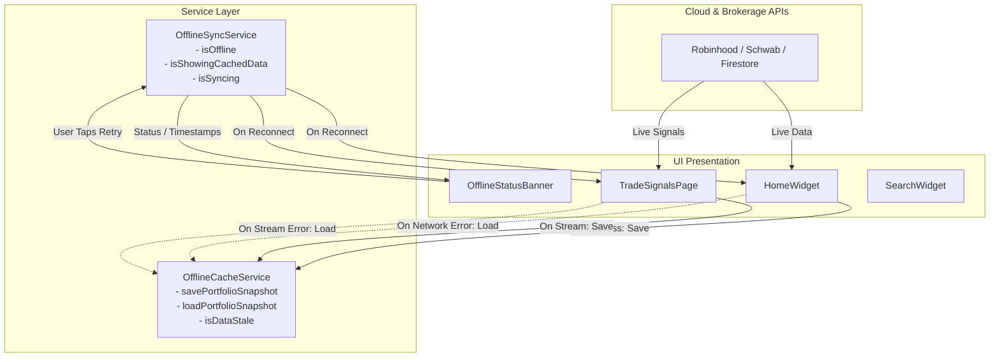

# Offline Mode & Resilient Caching

## Overview

The **Offline Mode & Resilient Caching** system ([#87](https://github.com/CIInc/robinhood-options-mobile/issues/87)) enables uninterrupted navigation and portfolio inspection across RealizeAlpha when network connectivity is degraded or absent. By persisting key brokerage states, quotes, positions, and AI trade signals locally with automatic synchronization on reconnect, traders maintain uninterrupted situational awareness regardless of cellular or Wi-Fi conditions.

---

## Key Features

1. **Persistent Portfolio Caching (`OfflineCacheService`)**:
   - Stores point-in-time `PortfolioSnapshot` structures encapsulating accounts, portfolios, equity, cash, buying power, stock positions (`InstrumentPosition`), and option aggregate positions (`OptionAggregatePosition`).
   - Persists AI trade signals, real-time quotes, and user watchlists in fast local key-value storage (`SharedPreferences`).
   - Tracks data freshness with ISO 8601 timestamps and computes relative freshness tags (e.g., "Just now", "5m ago", "2h ago", "Stale Data").

2. **Reactive Connectivity & Sync Service (`OfflineSyncService`)**:
   - `ChangeNotifier` providing real-time network reachability detection, offline simulation flags for automated testing, and synchronization lifecycle tracking (`isOffline`, `isSyncing`, `isShowingCachedData`).
   - Automatic reconnect trigger: registers listeners across screens (`registerReconnectCallback`) that refresh stale data immediately when network reachability returns.
   - Graceful manual refresh via `triggerSync()` with built-in debouncing and loading state propagation.

3. **Contextual Offline & Stale Status Banner (`OfflineStatusBanner`)**:
   - Animated status sliver banner displayed atop `HomeWidget`, `TradeSignalsPage`, and `SearchWidget`.
   - Distinct visual modes:
     - **Offline Mode**: Warns the trader of offline conditions with an alert icon and manual retry button.
     - **Viewing Cached Data**: Warns when data was served from local snapshot due to a network interruption, showing last sync timestamp and freshness badge.
     - **Sync In Progress**: Replaces retry button with smooth circular activity indicator while synchronization completes.
     - **Online & Fresh**: Silently hides to preserve screen real estate when data is live and connected.

4. **Resilient Fallback Integration Across Screens**:
   - **Home Screen (`HomeWidget`)**: Automatically saves fresh portfolio snapshots whenever network data is received; restores the last known cached snapshot if network calls fail or when launching without an active connection.
   - **Trade Signals (`TradeSignalsProvider`)**: Caches incoming signal streams; restores local trade signals seamlessly if Firestore streaming fails or network drops.
   - **Search & Watchlists (`SearchWidget`)**: Gracefully falls back to cached watchlist items and search results without crashing or displaying empty blank views.

---

## Architecture & Data Flow



---

## Usage & API Reference

### Saving a Snapshot
```dart
await OfflineCacheService.savePortfolioSnapshot(
  accounts: accountStore.items,
  portfolios: portfolioStore.items,
  stockPositions: stockStore.items,
  optionPositions: optionStore.items,
);
```

### Loading a Snapshot
```dart
final snapshot = await OfflineCacheService.loadPortfolioSnapshot();
if (snapshot != null) {
  // Populate local stores with cached data
}
```

### Registering Reconnect Handlers
```dart
@override
void initState() {
  super.initState();
  final syncService = Provider.of<OfflineSyncService>(context, listen: false);
  syncService.registerReconnectCallback(_handleReconnectSync);
}

Future<void> _handleReconnectSync() async {
  await _refreshData();
}

@override
void dispose() {
  final syncService = Provider.of<OfflineSyncService>(context, listen: false);
  syncService.unregisterReconnectCallback(_handleReconnectSync);
  super.dispose();
}
```

### Displaying the Banner
```dart
// Inside any CustomScrollView slivers list:
OfflineStatusBanner(
  padding: EdgeInsets.symmetric(horizontal: 16, vertical: 8),
  onRetry: () => _refreshData(),
)
```

---

## Verification & Testing

The offline mode functionality is validated through comprehensive unit and widget tests:
- `test/offline_cache_service_test.dart`: Serialization, deserialization, stale evaluation thresholds, relative formatting, and cache clearing.
- `test/offline_sync_service_test.dart`: Online/offline status transitions, reconnect callback execution, unregistering callbacks, and error message tracking.
- `test/offline_status_banner_widget_test.dart`: Widget rendering across offline, cached snapshot, stale data, and syncing states.
