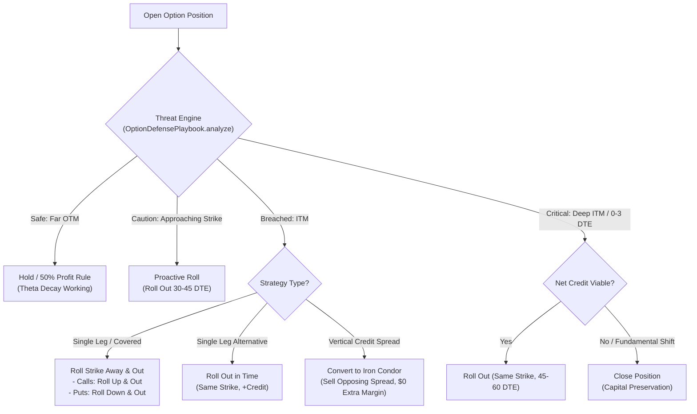

# Multi-Leg Options Defense & Roll Playbook

The **Multi-Leg Options Defense & Roll Playbook** (`OptionDefensePlaybookWidget`, [#158](https://github.com/CIInc/robinhood-options-mobile/issues/158)) is an institutional-grade threat detection engine and tactical advisory system for managing tested options positions, short legs, and credit spreads.

It systematically diagnoses position vulnerability and generates actionable, mathematically sound defensive adjustments (rolling out in time, widening spreads, inverted strangles, converting vertical spreads to iron condors) with seamless 1-tap transfer to the [Options Strategy Roll Assistant](options-strategy-roll-assistant.md).

---

## The Strategic Problem

Options sellers and credit traders generate income by capturing theta time decay. However, when an underlying equity makes a sharp directional move:
- **Short Calls / Covered Calls** are tested when the underlying rallies past the strike price.
- **Short Puts / Cash-Secured Puts** are tested when the underlying plummets below the strike price.
- **Credit Spreads** suffer accelerated delta and gamma risk as the tested short strike is approached or breached.

Without mechanical rules, retail traders frequently make fatal errors:
1. **Freezing**: Allowing an assignment or full max-loss breach without defending.
2. **Rolling for a Debit**: Paying money to roll a losing trade further in time, drastically increasing capital at risk.
3. **Over-defending inside 0-3 DTE**: Waiting until gamma swings make rolling for credit impossible.

The **Options Defense & Roll Playbook** solves this by establishing systematic, automated threat classification and prescriptive tactical maneuvers based on institutional Tastytrade and quantitative market-maker playbooks.

---

## Threat Classification Engine

The analysis engine evaluates the position's strike price, underlying spot price, days to expiration (DTE), delta ($\Delta$), and option moneyness:

| Threat Level | Status Badge | Condition | Tactical Prescription |
|---|---|---|---|
| **SAFE** | `SAFE` | Spot is > 2.5% OTM, $\Delta < 0.35$, DTE > 14 | Hold position, capture theta decay, manage at 50% profit target. |
| **CAUTION** | `CAUTION` | Spot within 2.5% of short strike, $\Delta \ge 0.35$, or DTE $\le 14$ | Proactive roll: Roll Out in Time or Roll Away & Out before gamma accelerates. |
| **BREACHED** | `BREACHED` | Spot crosses short strike (ITM), or $\Delta \ge 0.50$ | Active defense: Roll Strike Away (Up & Out / Down & Out) or Roll Out in Time for credit; convert to Iron Condor if credit spread. |
| **CRITICAL** | `CRITICAL` | Spot breached by > 3.0% or DTE $\le 3$ with strike breached | High-urgency defense: Roll Out in Time for credit or close position to prevent uncapped tail risk. |

---

## Tactical Playbook Maneuvers

### 1. Roll Out in Time (Duration Defense)
- **Objective**: Extend expiration by 21-45 days at the identical strike price.
- **Rationale**: Captures additional extrinsic value to lower the effective breakeven point and gives the underlying asset time to mean-revert.
- **Execution**: Automatically pre-selects `RollPreset.rollOut` in the Roll Assistant.

### 2. Roll Away & Out (Strike Defense)
- **Objective**: Move the short strike further away from the spot price (Roll Up & Out for Calls, Roll Down & Out for Puts) at a later expiration.
- **Rationale**: Lowers directional delta exposure and probability of expiring in-the-money, while using extended duration to finance the strike move.
- **Execution**: Automatically pre-selects `RollPreset.rollUpAndOut` or `RollPreset.rollDownAndOut`.

### 3. Convert to Iron Condor (Opposing Spread Defense)
- **Objective**: Sell an out-of-the-money credit spread on the untested side of the market (e.g., sell a Bear Call Spread if your Bull Put Spread is breached).
- **Rationale**: Brokerages only require margin for the wider side of an iron condor. Selling the opposing spread collects immediate net credit to cushion the tested spread's loss without increasing margin requirements.
- **Execution**: Direct navigation to trade options chain for opposing leg entry.

### 4. Close Position & Preserve Capital (Risk Control)
- **Objective**: Cut losses before terminal assignment or capital destruction occurs.
- **Rationale**: If the underlying asset's core thesis is invalidated or rolling for a net credit is mathematically impossible, closing limits losses to defined bounds.

---

## Institutional Defense Rules

The Playbook embeds core rules drawn from professional derivatives trading:

1. **Always Roll for Credit**: Never pay a net debit to defend a short option. Paying debits increases your maximum capital at risk on a losing trade.
2. **Defend at 21 DTE Benchmark**: Gamma risk accelerates exponentially inside 21 DTE. Defend or extend duration before rapid gamma swings amplify losses.
3. **Zero-Margin Opposing Spread**: When converting a tested credit spread into an Iron Condor, the new credit collected directly offsets losses with zero additional margin.
4. **Know When to Cut Losses**: If the short strike is breached by > 3% and cannot be rolled out for a net credit, close the position and reallocate capital.

---

## User Interface & Integration

1. **`OptionDefensePlaybookWidget`**:
   - **Header Threat Banner**: Color-coded threat indicator (Green, Amber, Orange, Red) displaying current status, distance to strike, short strike, spot price, DTE, and delta.
   - **Threat Diagnostics**: Concrete bullet points highlighting what triggered the alert.
   - **Tactical Playbook Actions**: Actionable cards with "⭐ RECOMMENDED DEFENSE", "ZERO MARGIN CREDIT", and "STRIKE DEFENSE" badges.
   - **1-Tap Roll Execution**: Pushes `OptionRollAssistantWidget` with the corresponding preset pre-selected.

2. **Access Points**:
   - **Option Instrument Details (`OptionInstrumentWidget`)**: Dedicated "Defense" tonal action button next to "Roll" and "Trade Option".
   - **Option Positions List (`OptionPositionsWidget`)**: Long-press bottom sheet offering direct navigation to "Defense Playbook" or "Roll Assistant".
   - **Roll Assistant (`OptionRollAssistantWidget`)**: AppBar action icon (`Icons.shield_outlined`) allowing instant review of tactical recommendations while crafting a roll.

---

## Verification & Testing

- **Unit Tests** ([`test/option_defense_models_test.dart`](../src/robinhood_options_mobile/test/option_defense_models_test.dart)):
  - Tested and breached Covered Call / Short Call ($\Delta > 0.50$, spot > strike).
  - Critical Cash-Secured Put (spot deep below strike with short DTE).
  - Caution Cash-Secured Put (approaching strike within 2% distance).
  - Safe OTM Position (unthreatened, hold/profit recommendation).
  - Vertical Credit Spread conversion to Iron Condor.
- **Widget Tests** ([`test/option_defense_playbook_widget_test.dart`](../src/robinhood_options_mobile/test/option_defense_playbook_widget_test.dart)):
  - Validates threat status banner, diagnostics findings, metrics grid, recommended playbook cards, and institutional rule accordions.
