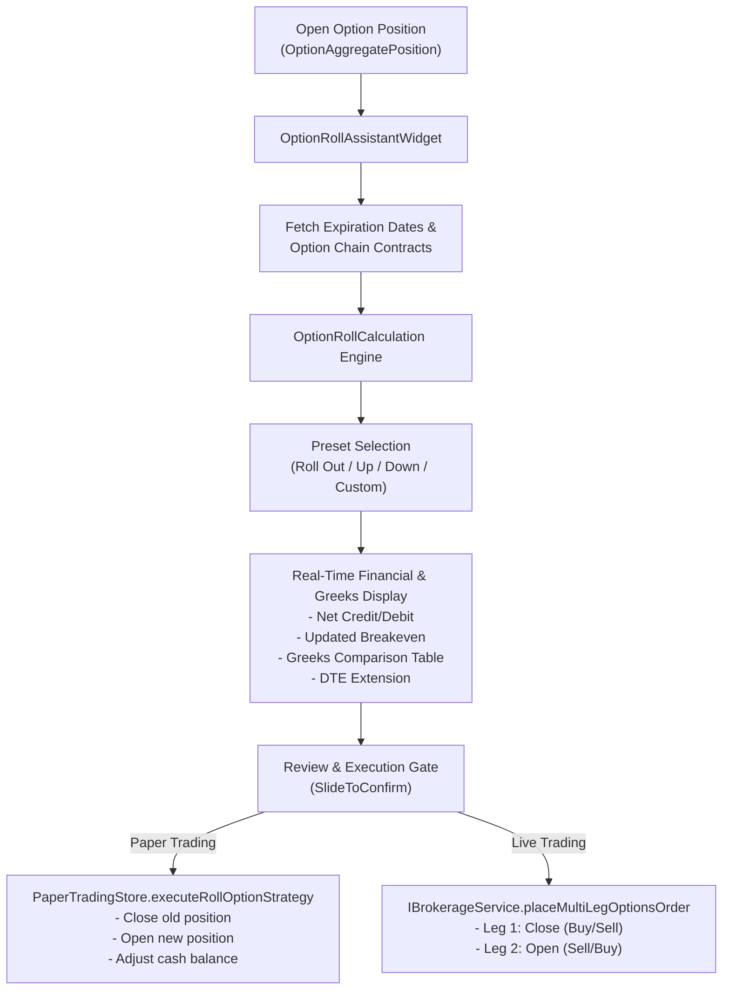

# Options Strategy Roll Assistant

The **Options Strategy Roll Assistant** (`OptionRollAssistantWidget`, [#157](https://github.com/CIInc/robinhood-options-mobile/issues/157)) is an institutional-grade, 1-tap rolling wizard designed to simplify and optimize options position management. It supports single-leg short and long calls/puts, covered calls, cash-secured puts, and vertical spreads.

---

## Key Capabilities

1. **Automated Net Credit/Debit Calculation**:
   - Calculates real-time net price differential between closing the expiring contract and opening the replacement contract.
   - Distinct classification of net credit (proceeds generated) versus net debit (cash required).
   - Total cash impact calculation scaled to position contract quantity (`netPrice * quantity * 100`).

2. **Updated Breakeven Projections**:
   - Computes updated breakeven thresholds accounting for underlying equity cost basis and cumulative net credits received.
   - Supports strategy-aware formulas:
     - **Covered Call**: `Cost Basis - Closing Cost + Opening Proceeds` (or `Strike + Net Credit`).
     - **Cash-Secured Put**: `Strike - Net Credit` (or `Strike - Opening Proceeds + Closing Cost`).
     - **Long Options**: `Strike ± Net Debit`.

3. **Greeks & Exposure Shift Analysis**:
   - Direct side-by-side comparison between the current contract and target replacement contract:
     - **Delta ($\Delta$)**: Shift in directional equity exposure and probability of expiring in-the-money.
     - **Gamma ($\Gamma$)**: Curvature and acceleration of Delta.
     - **Theta ($\theta$)**: Daily time-decay velocity capture.
     - **Vega ($\nu$)**: Exposure to implied volatility expansion/contraction.
     - **Implied Volatility (IV)**: Volatility differential between expirations.
   - Calculates days-to-expiration (DTE) extension ($\Delta\text{DTE}$).

4. **1-Tap Strategic Roll Presets**:
   - **Roll Out (Same Strike)**: Extends expiration date while keeping the exact same strike price. Useful for collecting additional extrinsic value when thesis is intact.
   - **Roll Up & Out (+Strike)**: Rolls to a higher strike on a later expiration date. Ideal for defending or optimizing covered calls when underlying price rallies.
   - **Roll Down & Out (-Strike)**: Rolls to a lower strike on a later expiration date. Ideal for defending cash-secured puts when underlying price declines.
   - **Custom Roll**: Complete freedom to select any expiration date and strike from the option chain.

5. **Multi-Leg Atomic Order Execution**:
   - Seamlessly generates atomic 2-leg order payloads (`position_effect: 'close'` and `position_effect: 'open'`) compatible with both Robinhood and Schwab brokerage endpoints.
   - Full support in Paper Trading mode (`PaperTradingStore.executeRollOptionStrategy()`) simulating position closing, opening, and cash adjustments with audit logging.
   - Equipped with `SlideToConfirm` order safety slider.

---

## Architecture & Data Flow



---

## Domain Model: `OptionRollCalculation`

Defined in [`lib/model/option_roll_models.dart`](file:///Users/aymericgrassart/Documents/Repos/github.com/CIInc/robinhood-options-mobile/src/robinhood_options_mobile/lib/model/option_roll_models.dart):

```dart
class OptionRollCalculation {
  final OptionInstrument closingOption;
  final OptionInstrument openingOption;
  final int quantity;
  final bool isShort;
  final double? underlyingPrice;
  final double? underlyingCostBasis;
  final String strategyType;
  final double closingPrice;
  final double openingPrice;

  // Computed properties:
  double get closingCostPerShare;
  double get openingProceedsPerShare;
  double get netPrice;
  String get creditOrDebit; // 'credit' or 'debit'
  double get totalCashAmount;
  int get dteDelta;
  double? get updatedBreakeven;
  double? get currentDelta;
  double? get targetDelta;
  double? get deltaShift;
  double? get currentTheta;
  double? get targetTheta;
  double? get thetaShift;

  List<Map<String, dynamic>> buildOrderLegs();
}
```

### 2-Leg Order Structure

The order builder generates standardized legs accepted by brokerages:

```dart
// For a Short Call (e.g. Covered Call):
Leg 1: {
  "option": closingOption.url,
  "position_effect": "close",
  "side": "buy",
  "ratio_quantity": 1
}
Leg 2: {
  "option": openingOption.url,
  "position_effect": "open",
  "side": "sell",
  "ratio_quantity": 1
}
```

---

## Navigation & User Access

The Roll Assistant is accessible via two intuitive entry points:

1. **Option Instrument Details (`OptionInstrumentWidget`)**:
   - When the user holds an active position in the inspected option contract, a prominent **"Roll"** tonal button is displayed in the primary action bar alongside Buy and Sell.
2. **Option Positions List (`OptionPositionsWidget`)**:
   - Long-pressing on any active option position tile triggers direct navigation to `OptionRollAssistantWidget` pre-populated with the selected contract.

---

## Testing & Verification

- **Unit Tests** ([`test/option_roll_models_test.dart`](file:///Users/aymericgrassart/Documents/Repos/github.com/CIInc/robinhood-options-mobile/src/robinhood_options_mobile/test/option_roll_models_test.dart)):
  - Validates net credit / debit formulas for covered calls, cash-secured puts, and long calls.
  - Tests Roll Up & Out and Roll Down & Out strike shift math.
  - Verifies fallback mechanisms when bid/ask quotes are missing or zero.
- **Widget Tests** ([`test/option_roll_assistant_widget_test.dart`](file:///Users/aymericgrassart/Documents/Repos/github.com/CIInc/robinhood-options-mobile/src/robinhood_options_mobile/test/option_roll_assistant_widget_test.dart)):
  - Verifies screen rendering, strategy badge detection, current leg cards, preset chip switching, horizontal date/strike scrolling, and order review leg generation.
