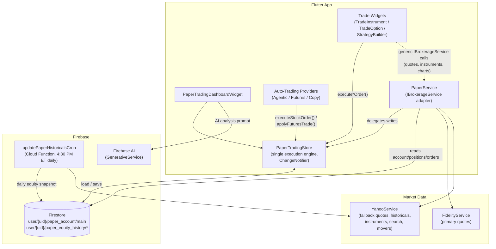
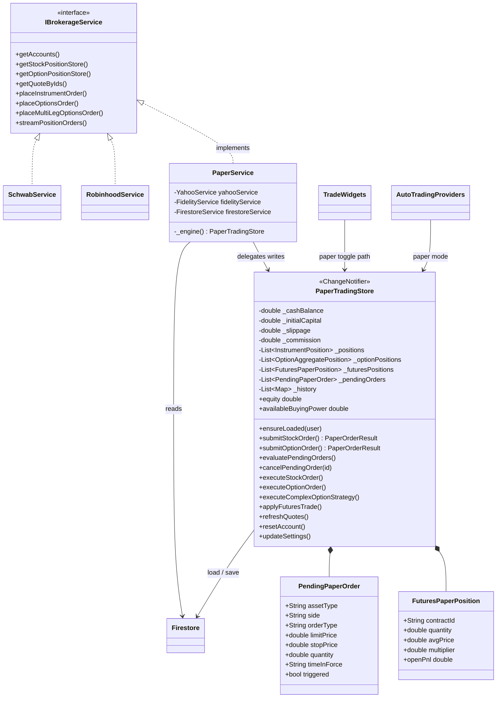
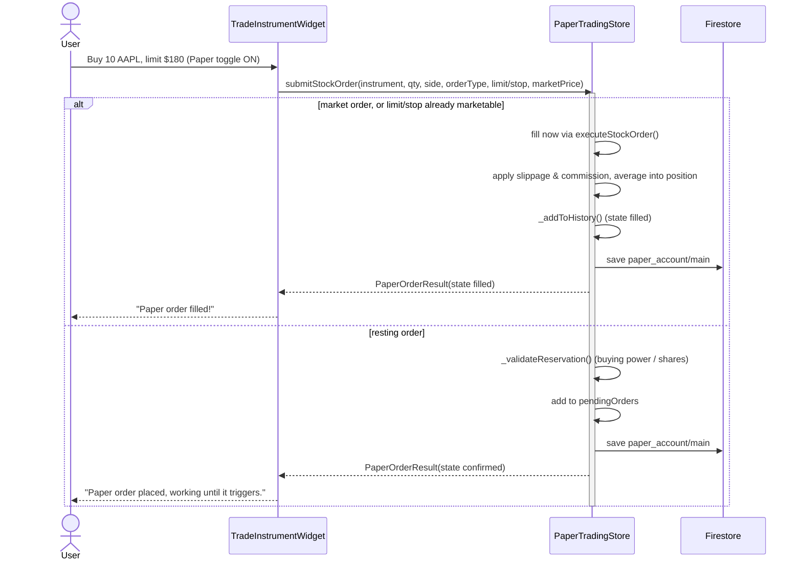
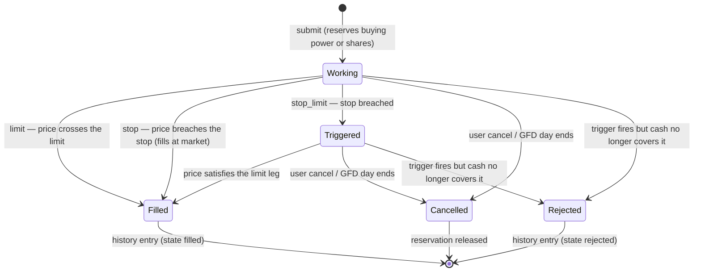
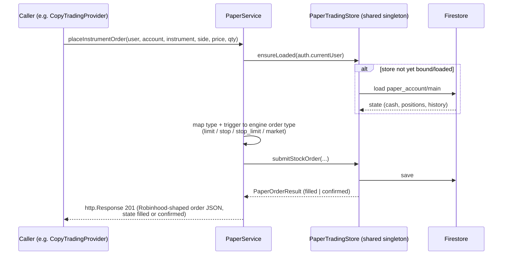
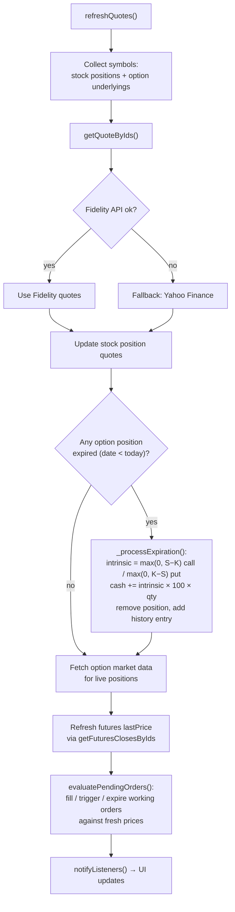
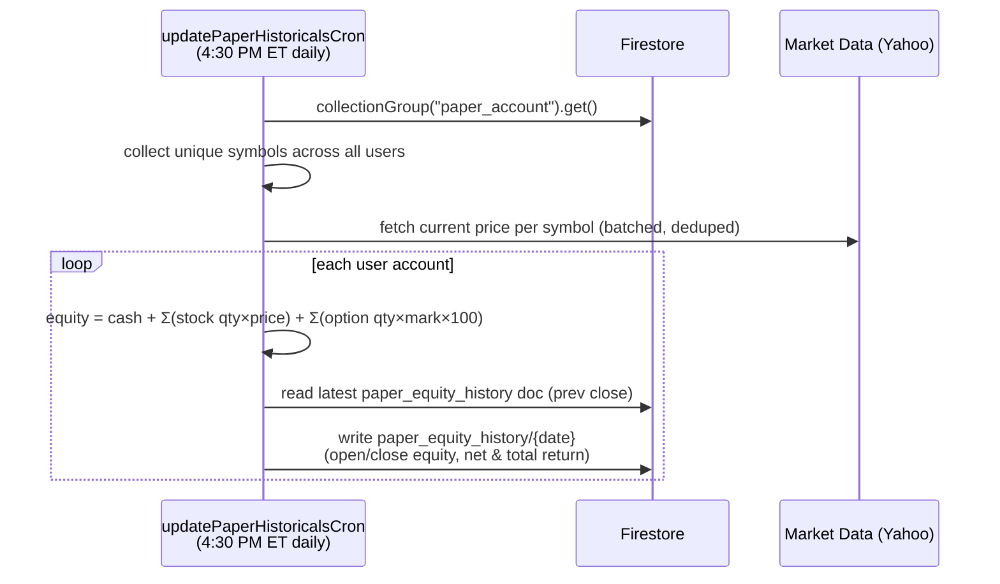
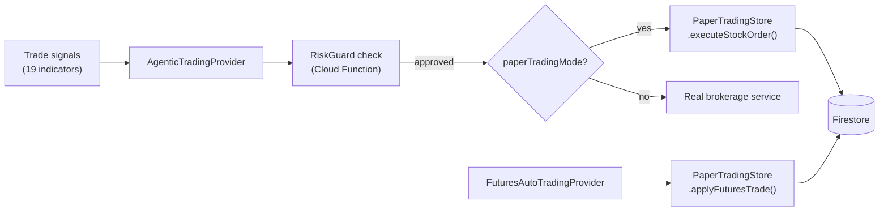
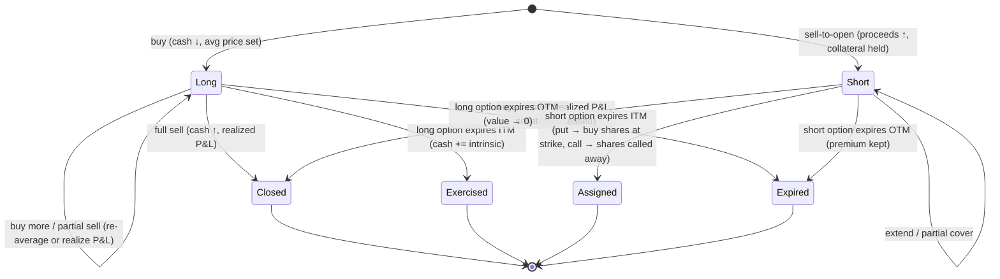

# Paper Trading — Architecture & Technical Design

> Companion to the user-facing [Paper Trading](paper-trading.md) feature doc.
> Reflects the unified single-engine architecture (2026-07).

## 1. Overview

Paper Trading simulates a brokerage account with virtual capital (default **$100,000**)
against **real market data**. It supports stocks, single-leg options, multi-leg option
strategies, and futures (via auto-trading), and is used both by manual trading UI and by
the automated trading systems (Agentic Trading, Futures Auto-Trading, Copy Trading).

### Design goals

1. **Single source of truth** — all paper order execution flows through one engine
   (`PaperTradingStore`) so cash, positions, and history can never diverge.
2. **Brokerage parity** — paper trading plugs into the same `IBrokerageService`
   interface as Robinhood/Schwab/Fidelity, so every widget and provider works
   unmodified when the account source is `BrokerageSource.paper`.
3. **Real market data** — quotes, historicals, and option market data come from real
   providers (Fidelity primary, Yahoo Finance fallback), so simulated fills track
   reality.
4. **Cloud-persisted** — state lives in Firestore under the Firebase user, surviving
   reinstalls and syncing across devices; a scheduled Cloud Function builds the
   long-term equity curve.

## 2. System Context



**Key rule:** `PaperService` never writes account state to Firestore directly. Reads go
straight to Firestore (cheap, stateless); **all mutations delegate to the shared
`PaperTradingStore` instance** exposed as an app-wide singleton in `main.dart`.

## 3. Components

| Component | File | Responsibility |
|---|---|---|
| `PaperTradingStore` | `lib/model/paper_trading_store.dart` | **The engine.** Owns cash/positions/working-orders/history state, executes orders (immediate + resting limit/stop with reservations and trigger evaluation), applies slippage & commission, processes option expiration, persists to Firestore, notifies UI. |
| `PaperService` | `lib/services/paper_service.dart` | `IBrokerageService` implementation for `BrokerageSource.paper`. Serves reads (accounts, portfolios, positions, quotes, charts) and delegates order placement to the engine. Returns Robinhood-shaped `http.Response` bodies for caller compatibility. |
| `paperTradingStore` global | `lib/main.dart` | Lazy app-wide singleton; the Provider tree and `PaperService` bind to the same instance. |
| `FirestoreService` (paper helpers) | `lib/services/firestore_service.dart` | Read-only paper helpers: `getPaperAccountDoc`, `listPaperPositions`, `listPaperOptionPositions`, `streamPaperOrders`, `getPaperHistory`. Write helpers were deliberately removed — writes go through the engine. |
| `PaperTradingDashboardWidget` | `lib/widgets/paper_trading_dashboard_widget.dart` | Portfolio summary (buying power net of reservations), AI analysis, allocation chart, positions, working orders with cancel, order history, settings (slippage/commission), reset. |
| Trade widgets | `lib/widgets/trade_instrument_widget.dart`, `trade_option_widget.dart`, `strategy_builder_widget.dart` | "Paper Trade" toggle (forced **on** for paper-source accounts); route execution to the engine when enabled. |
| Auto-trading providers | `lib/model/agentic_trading_provider.dart`, `futures_auto_trading_provider.dart` | Call the engine directly when `paperTradingMode` is enabled. |
| `updatePaperHistoricalsCron` | `functions/src/paper-trading-cron.ts` | Scheduled Cloud Function: values every paper account at market close (stocks incl. shorts, options incl. written, futures — via `paper-trading-utils.ts`) and appends a daily equity snapshot; skips weekends. |
| `InstrumentOrder.fromPaperJson` | `lib/model/instrument_order.dart` | Parses unified history entries (and legacy formats) into the standard order model for the orders UI. |

### Class relationships



## 4. Data Model (Firestore)

```
user/{uid}/
├── paper_account/
│   └── main                          ← single document, whole-state save
│       ├── cashBalance: number
│       ├── initialCapital: number
│       ├── slippage: number          (per share/contract, $)
│       ├── commission: number        (per trade, $)
│       ├── positions: [ ... ]        (stock positions, snake_case + instrumentObj;
│       │                              negative quantity = short)
│       ├── optionPositions: [ ... ]  (aggregate positions with legs[] + optionInstrument;
│       │                              direction 'credit' = written/short)
│       ├── futuresPositions: [ ... ] (contractId, quantity, avgPrice, multiplier, lastPrice)
│       ├── pendingOrders: [ ... ]    (working limit/stop orders: id, assetType, side,
│       │                              orderType, limitPrice, stopPrice, trailType,
│       │                              trailValue, watermark, quantity, timeInForce,
│       │                              positionEffect, triggered, instrumentJson)
│       ├── history: [ ... ]          (last 100 fills, unified entry format, newest first)
│       └── updatedAt: serverTimestamp
└── paper_equity_history/
    └── {YYYY-MM-DD}                  ← one doc per trading day (written by cron)
        ├── open_equity / close_equity
        ├── net_return / total_return / total_return_percentage
        ├── begins_at: serverTimestamp
        └── session: "regular"
```

### Unified history entry format

Every fill appends one entry serving **two consumers**: the dashboard history list and
`InstrumentOrder.fromPaperJson` (orders UI via `streamPositionOrders`).

| Key | Example | Consumer |
|---|---|---|
| `id` | `paper_1770000000000` | orders UI |
| `type` | `STOCK` \| `OPTION` \| `STRATEGY` \| `FUTURES` \| `EXPIRATION` | dashboard (asset class), stream filter |
| `action` / `side` | `BUY` / `buy` | dashboard / orders UI |
| `state` | `filled` (also `cancelled` for GFD expiry, `rejected` for unfundable triggers) | orders UI |
| `order_type` | `limit`, `market` | orders UI |
| `symbol`, `quantity`, `price` | `AAPL`, `10`, `195.30` | both |
| `instrument` | instrument URL | orders UI |
| `timestamp`, `created_at`, `updated_at` | ISO-8601 | both |
| `detail`, `profitLoss`, `multiplier` | free text / numbers | dashboard |

`streamPositionOrders` filters out non-stock classes (`option`, `futures`, `strategy`,
`expiration`) so option/futures fills don't masquerade as stock orders.

## 5. Key Flows

### 5.1 Manual stock order (trade widget path)



### 5.2 Resting-order lifecycle

Working orders are re-evaluated on every quote refresh (dashboard load and
pull-to-refresh) with fresh stock quotes and option marks.



Fills execute at the **observed market price** (capped by the limit), then flow
through the same `executeStockOrder`/`executeOptionOrder` primitives — slippage,
commission, averaging, and history apply identically to immediate and triggered
fills.

### 5.3 Order via the brokerage interface (`PaperService` path)

Used by callers that only know `IBrokerageService` (copy trading, agentic fallback,
generic order UIs).



`ensureLoaded` prevents a race where an order executed against unloaded default state
would be overwritten by a pending Firestore load.

### 5.4 Quote refresh & option expiration

Triggered on dashboard load and pull-to-refresh.



### 5.5 Daily equity snapshot (Cloud Function)



The client (`PaperService.getPortfolioHistoricals`) merges these snapshots with a
live "now" point to render the portfolio chart.

### 5.6 Automated paper trading



Because the providers and the manual UI share the same engine instance, automated and
manual paper trades compose safely — cash and positions stay consistent.

## 6. Execution Model

Market orders fill immediately; limit/stop/stop-limit orders rest until triggered:

| Aspect | Behavior |
|---|---|
| Market orders | Fill instantly at the current market price |
| Limit orders | Fill at the market price when it crosses the limit (immediately if already marketable); otherwise rest |
| Stop orders | Rest until the market price breaches the stop, then fill at market |
| Stop-limit orders | Stop breach arms the limit leg (`triggered`), which then fills when marketable |
| Trailing stop orders | Watermark (best observed price) ratchets in the favorable direction on each refresh; triggers when the price retraces by the trail (`$` amount or `%`), filling at market. Sells trail the high, buys trail the low |
| Trigger evaluation | On every quote refresh (dashboard load / pull-to-refresh) via `evaluatePendingOrders`; client-side only — orders do not trigger while the app is closed |
| Reservations | Working buys reserve `qty × (limit ?? stop) × multiplier + commission` of buying power; working sells reserve position quantity — over-committing is rejected at submit |
| Time in force | `gtc` persists; `gfd` expires at the end of its trading day (history entry, state `cancelled`) |
| Unfundable triggers | If cash was consumed before a trigger fired, the order is rejected (history entry, state `rejected`), not retried |
| Slippage | Configurable `$/share` (or `$/contract`): buys fill at `price + slippage`, sells at `price − slippage` |
| Commission | Configurable flat `$/trade`, added to cost on buys, subtracted from proceeds on sells |
| Position averaging | Extending a position (long or short) re-averages the entry price; reductions keep it |
| Position close | Quantity at ~0 removes the position; realized P&L recorded in the history entry |
| **Short stock** | Sell with no position opens a short (negative quantity); proceeds credited. **150% of entry value required to open (Reg-T); 130% of current market value held as maintenance**, marked to market on each refresh. Buy-to-cover realizes `(avg − price) × qty`. Long/short flips in one order are rejected |
| **Margin calls** | After each quote refresh, `processMarginCalls` checks cash against reservations + maintenance. Deficits force partial buy-to-covers (largest exposure first, only as many shares as needed); an unresolvable deficit logs a `MARGIN` warning entry |
| **Cash-secured puts** | Sell-to-open holds `strike × 100` per contract as collateral; premium credited. Buy-to-close realizes the premium spread |
| **Covered calls** | Sell-to-open requires 100 unpledged long shares of the underlying per contract (naked calls rejected); pledged shares can't be sold while the call is open |
| Options | Multiplier 100; positions carry `direction` (`debit` long / `credit` written); written positions subtract from equity as a liability |
| Option expiration | Longs cash-settle intrinsic value; expired-OTM shorts keep the premium; **ITM short puts are assigned** (buy 100/contract at the strike from collateral); **ITM covered calls are called away** (shares sold at the strike, P&L vs cost basis) |
| Futures | Signed quantity supports long and short; realized P&L on close/reverse: `(price − avg) × qty × multiplier`; open P&L marked to `lastPrice` |
| Validation | Buys require sufficient cash; sells require held quantity or collateral capacity for the short; final enforcement re-runs at trigger time for resting orders |

### Position lifecycle



## 7. Design Decisions

1. **Single engine, adapter on top.** Earlier, `PaperService` and `PaperTradingStore`
   both wrote to `paper_account/main` with different logic (duplicate position entries
   via `arrayUnion`, sells that credited cash without reducing positions). The engine
   is now the only writer; `PaperService` is a thin `IBrokerageService` adapter. The
   corrupt Firestore write helpers were removed so the bad path cannot return.
2. **App-wide singleton via lazy global.** The store is exposed as a lazy getter in
   `main.dart` (mirroring the `auth` global) and bound into the Provider tree, so
   context-free callers (services, providers) and widgets share one instance. Laziness
   keeps widget tests able to pump `MyApp` without touching Firestore.
3. **Whole-document save.** State is small (≤100 history entries, a handful of
   positions), so each mutation rewrites `paper_account/main` in one `set()`. Simple
   and atomic per write; last-write-wins across devices is acceptable at this scale.
4. **Robinhood-shaped responses.** `PaperService` order methods return
   `http.Response` bodies matching the Robinhood order schema so generic callers
   (`InstrumentOrder.fromJson`, copy-trade UI) work without paper-specific branches.
5. **Real quotes, two-tier sourcing.** Fidelity first for freshness, Yahoo as
   fallback — paper trading needs no brokerage session, so it also serves as the
   app's "guest mode" data path.
6. **History as an embedded, capped array.** The last 100 fills live inside the main
   doc (one read for the dashboard); the long-term record is the cron-built
   `paper_equity_history` collection.

## 8. Known Limitations & Roadmap

~~No resting orders~~ — **done (2026-07):** limit/stop/stop-limit orders rest with
reservations, trigger on quote refresh, and support cancel (see §5.2/§6).

~~No short selling / option writing~~ — **done (2026-07):** short stock (150%
collateral), cash-secured puts, covered calls, buy-to-close, and
expiration assignment (see §6).

~~No true margin for shorts~~ — **done (2026-07):** short-stock maintenance is
marked to market (130% of current value) with an automatic margin-call sweep
on every quote refresh; naked options remain unsupported by design.

~~Equity cron gaps~~ — **done (2026-07):** the daily snapshot now values
futures and written options (via `computePaperAccountEquity`, shared rules
with the client engine), skips weekends, and account reset clears
`paper_equity_history` so the chart restarts from the new capital.

| # | Gap | Notes |
|---|---|---|
| 1 | **No naked options** — calls must be covered, puts fully cash-secured | Naked short options would need a full options-margin model |
| 2 | **Client-side trigger evaluation only** — working orders (incl. trailing stops) don't trigger while the app is closed | Server-side evaluation could ride the existing cron or a more frequent function |
| 3 | **No market-hours or settlement rules** — fills 24/7, no T+2, no PDT | |
| 4 | **Corporate actions ignored** — no dividends, splits, or interest on paper positions | |
| 5 | **No crypto/forex paper trading** — `placeForexOrder` unimplemented | |
| 6 | **Multi-leg via brokerage interface needs Firestore-resolvable option instruments** — the strategy builder's direct engine path is the reliable route | |

## 9. Testing

| Layer | Location | Approach |
|---|---|---|
| Equity valuation (cron) | `functions/tests/paper-trading-utils.test.ts` | Jest tests for `computePaperAccountEquity` (shorts, written options, futures, fallbacks) and the trading-day guard |
| Maintenance margin | `test/paper_trading_margin_test.dart` | Margin-call sweep: healthy/improved accounts untouched, partial covers with exact share math, blown-account full liquidation + warning, multi-short ordering, CSP immunity |
| Shorts & collateral | `test/paper_trading_short_test.dart` | Short stock (open/extend/cover/reject), cash-secured puts, covered calls, buy-to-close, expiration assignment, equity math |
| Trailing stops | `test/paper_trading_trailing_stop_test.dart` | Watermark ratchet, $/% trails, buy-side (cover) trails, moving reservations, validation, GFD, JSON round-trip |
| Resting-order engine | `test/paper_trading_pending_orders_test.dart` | Direct engine tests: immediate vs resting fills, limit/stop/stop-limit triggers, reservations, cancel, GFD/GTC, rejection on unfundable triggers, JSON round-trip |
| Widget + engine wiring | `test/full_paper_trading_test.dart` | Fake store (`implements PaperTradingStore`) injected via Provider; verifies trade widgets route paper orders to the engine |
| Strategy builder | `test/strategy_builder_paper_trade_test.dart` | Mock store (`extends PaperTradingStore`); paper toggle behavior |
| Integration | `integration_test/guest_paper_trading_test.dart` | End-to-end guest paper trading flow |
| Firestore behavior | `fake_cloud_firestore` | In-memory Firestore for store persistence tests |

---

*Related docs: [Paper Trading (user guide)](paper-trading.md) ·
[Agentic Trading](agentic-trading.md) · [Advanced Order Types](advanced-order-types.md) ·
[Copy Trading](copy-trading.md) · [ER Diagram](er-diagram.md)*
